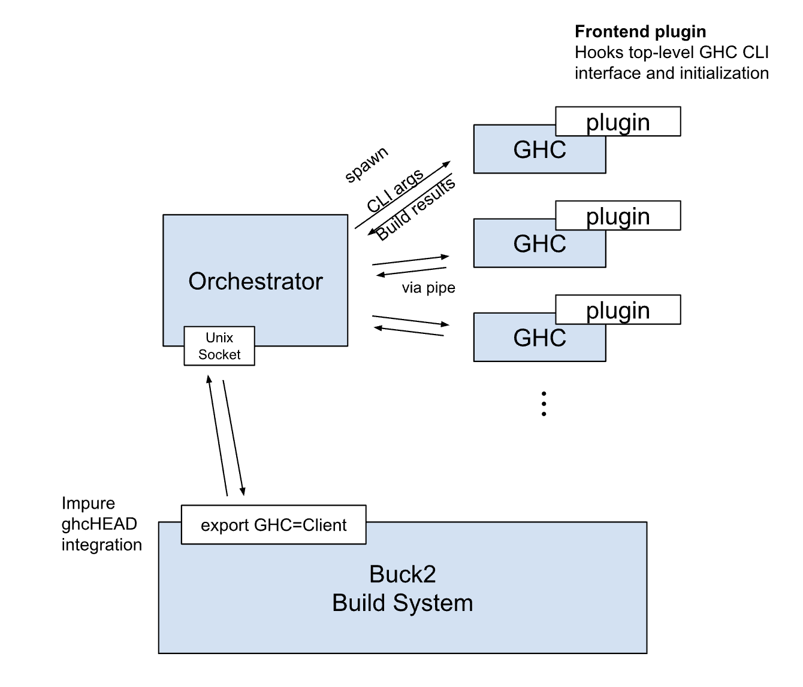

ghc-persistent-worker
=====================

Persistent worker (compiler server) implementation. 
GHC persistent worker currently works with Buck2.

The system consists of three components. 

* **ghc-persistent-worker-plugin**: GHC frontend plugin. With this plugin installed, 
  GHC runs as server that keeps receiving compilation requests. Input/Output interface 
  is through stdin/stdout pipe, i.e. gets CLI arguments and environment variables 
  through stdin, and then reports the compilation result back to stdout. 
  After serving one request, it will reinitialize its state, but it can also retain 
  sharable state between requests, such as loaded dynamic library and loaded byte code.
  What is shared throughout the whole running process will be customizable.
* **ghc-persistent-worker-server**: Orchestrator daemon that spawns multiple GHC processes 
  with ghc-persistent-server-plugin. The server manages a pool of GHCs and listen a Unix 
  socket for getting the requests from the client, and distribute the works to the pool.
  Individual GHCs are connected with the server by stdin/stdout and fifo pipes.
* **ghc-persistent-worker-client**: GHC Client. The CLI arguments of this client is identical
  to ordinary GHC and it sends those arguments to the server. 

