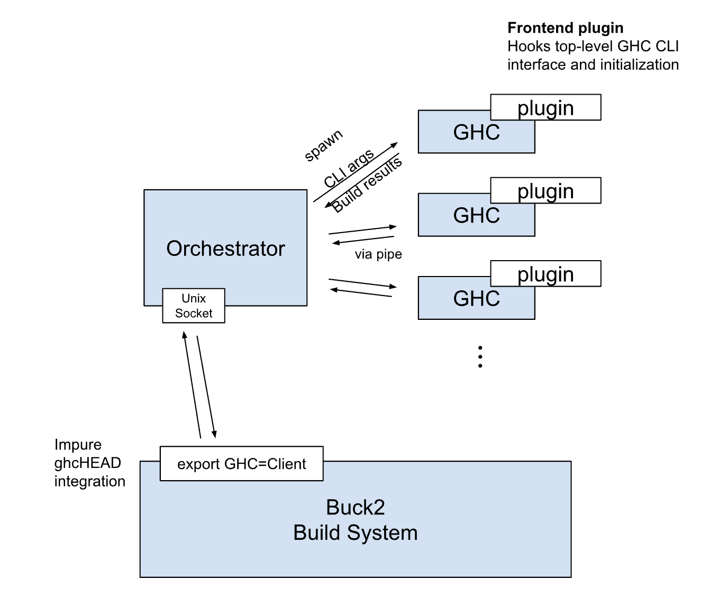

ghc-persistent-worker
=====================

Persistent worker (compiler server) implementation.
GHC persistent worker currently works with Buck2.



The system consists of three components.

* **ghc-persistent-worker-plugin**: GHC frontend plugin. With this plugin installed,
  GHC runs as server that keeps receiving compilation requests. Input/Output interface
  is through stdin/stdout pipe, i.e. gets CLI arguments and environment variables
  through stdin, and then reports the compilation result back to stdout.
  After serving one request, it will reinitialize its state, but it can also retain
  sharable state between requests, such as loaded dynamic library and loaded byte code.
  What is shared throughout the whole running process will be customizable.
* **ghc-persistent-worker-server**: Orchestrator daemon that spawns multiple GHC processes
  with ghc-persistent-server-plugin. The server manages a pool of GHCs and listen a Unix
  socket for getting the requests from the client, and distribute the works to the pool.
  Individual GHCs are connected with the server by stdin/stdout pipes.
* **ghc-persistent-worker-client**: GHC Client. The CLI arguments of this client is identical
  to ordinary GHC and it sends those arguments to the server.


To start:
```
$ cabal install --lib ghc-persistent-worker-plugin
$ cabal run ghc-persistent-worker-server -- --ghc ~/repo/srcc/ghcHEAD/_build/stage1/bin/ghc --socket-path /tmp/ghc_server.ipc -n 10
$ GHC_PERSISTENT_WORKER_SOCKET=/tmp/ghc_server.ipc cabal run ghc-persistent-worker-client -- test/A.hs
```
(optionally, one can set `--package-db (pkg_db_path)`. One can have multiple `--package-db`.)

Cabal Flags
===========

The project has a few optional features that depend on recent or experimental patches in GHC.
These can be toggled by specifying corresponding Cabal flags, which enable CPP defines during the build.
For example, running `cabal build -ffixed-nodes` enables the fixed nodes feature.

* Fixed nodes `-ffixed-nodes`/`-DFIXED_NODES`

  This feature takes advantage of the new lightweight module graph nodes to reduce the time it takes to restore module
  graphs from the file system cache.
  Fixed nodes only store the path to a module's interface, rather than requiring the parsed AST like conventional module
  graph nodes, but can not be used to compile the module.
  We use this node type when a module and its dependencies haven't been modified since the last build, so it can be
  expected that it won't be requested for compilation.

* Unit index `-funit-index`/`-DUNIT_INDEX`

  In projects with a large number of units, the performance of unit state initialization degrades substantially, because
  GHC wasn't designed for this use case.
  In particular, the package DB files of each unit's dependencies are read from disk unconditionally, even though they
  are often identical across units.
  Furthermore, the lookup table that associates module names with the packages that contain them is duplicated with
  heavy redundancies.
  In this GHC patch, these operations are abstracted away, allowing us to provide an efficient implementation locally
  that shares all of this data.

* Downsweep cache `-fdownsweep-cache`/`-DDOWNSWEEP_CACHE`

  This is a simple optimization that allows reusing old module graphs when recomputing a new graph, which we use to
  provide dependency graphs from our state.

HLS
===

When the GHC used to build HLS includes patches that influence CPP pragmas in the worker, you need to enable those in
`cabal.project`.

An HLS version patched for the MWB GHC can be run with `nix run .#hls`.

Cachix
======

In order to avoid having to rebuild GHC when first using a new upstream change, you can add this Cachix instance to your
Nix config:

```nix
  nix = {
    settings.substituters = ["https://ghc-server.cachix.org"];
    settings.trusted-public-keys = ["ghc-server.cachix.org-1:VPQv6cKWK7QjnkgE/v2zMBAvqdSdyRsLt2xGh7APKWc="];
  };
```

It can be provided as CLI arguments as well:

```
$ nix --option extra-substituters https://ghc-server.cachix.org --option extra-trusted-public-keys ghc-server.cachix.org-1:VPQv6cKWK7QjnkgE/v2zMBAvqdSdyRsLt2xGh7APKWc= run .#buck-tests
```
